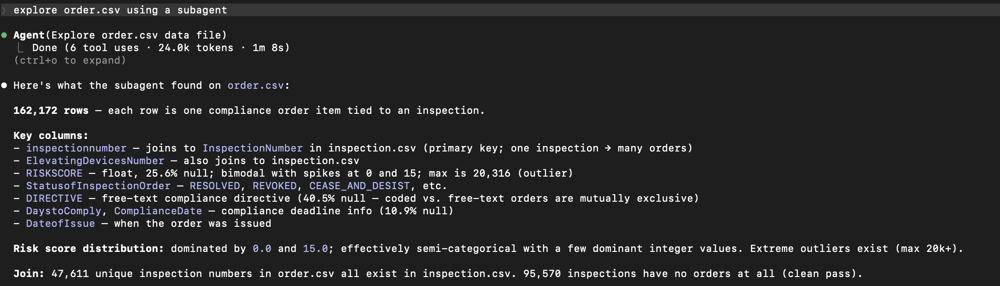

# AI Interaction Log

## Task 1 — Monorepo setup

Prompt: "Create a README.md for the Rocket Elevators Operations Dashboard. Include: 1) Project name. 2) A short paragraph describing an internal Ontario elevator dashboard that replaces spreadsheets and tracks overdue inspections. 3) A list of directories: /platform, /intelligence, /data, /docs."

What happened: Copilot CLI first checked whether the README already existed to avoid overwriting. It reported that the path did not exist, which looked like an error at first, but it was just a safety check before creating the file.

What I would change: I would be slightly more explicit about the business context, but for a README the summary was clear and helpful for a team to quickly understand the project.


## Task 3 — Dashboard specification

Prompt: "Create a technical specification for the Rocket Elevators Operations Dashboard. It must define layout, data sources and join logic, summary metrics, detail table columns and behavior, visual style, and data assumptions. The spec must be explicit and must not leave open choices or alternatives."

What happened: Copilot first produced a spec but left some optional choices, including wording like "for example" and "e.g." in a few places. That made the output slightly ambiguous for a spec that needs fixed decisions. I asked for stricter definitions, and it removed the open-ended phrasing and set exact values.

What I would change: I would be more explicit from the start that no alternatives are allowed and that every UI and data rule must be fixed (colors, labels, formats, and text). Being this specific avoids follow-up corrections and results in a cleaner, unambiguous specification.


## Task 3 — Dashboard specification (Tailwind classes)

Prompt: "Add explicit Tailwind CSS class definitions for the final dashboard so the UI is deterministic and not open to interpretation."

What happened: When Tailwind classes are not defined precisely, the outputs vary across different prompts and responses, which is not the goal for a fixed UI spec. I asked for exact class lists so the result is consistent.

What I would change: I will always require explicit Tailwind class lists for every UI element to prevent inconsistent results between prompts.


## Task 3 — Dashboard specification, iteration 2 (technology stack)

Prompt: "Review dashboard_spec.md and identify anything that is ambiguous or unspecified that would cause an AI to make an open choice when building the dashboard."

What happened: The spec did not define the technology stack. When asked to build the dashboard, the model had to decide between plain HTML, React, and Python on its own, which is an open choice that changes the entire implementation.

What I would change: Add a Technology Stack section to the spec from the beginning, fixing the implementation to a single static HTML file with Tailwind via CDN and vanilla JavaScript for sorting. This removes any ambiguity about what kind of file to produce.


## Task 3 — Dashboard specification, iteration 2 (table section title)

Prompt: "Review dashboard_spec.md and identify anything that is ambiguous or unspecified that would cause an AI to make an open choice when building the dashboard."

What happened: The spec defined the Tailwind classes for the table section title element but never specified what text it should display. The model would have to invent a label, leading to inconsistent results across prompts.

What I would change: Always include the exact display text for every labelled UI element in the spec. In this case, adding "display the text Elevator Fleet" next to the class definition removes the ambiguity completely.


## Task 3 — Dashboard specification, iteration 2 (active sidebar link)

Prompt: "Review dashboard_spec.md and identify anything that is ambiguous or unspecified that would cause an AI to make an open choice when building the dashboard."

What happened: The spec defined active and default sidebar link styles but never said which link should be active when the dashboard loads. The model would have to guess, and different runs produced different active links.

What I would change: State explicitly in the sidebar layout section which link is active. Since this is a single-page static file, the Dashboard link is always active and that should be fixed in the spec rather than left to interpretation.


## Task 3 — Dashboard specification, iteration 2 (output file location)

Prompt: "Review dashboard_spec.md and identify anything that is ambiguous or unspecified that would cause an AI to make an open choice when building the dashboard."

What happened: The spec described what to build but never said where to save the output file or what to name it. The model placed the file in different locations across sessions (index.html, dashboard.html, platform/dashboard.html).

What I would change: Include the exact output path in the Technology Stack section: platform/index.html. A spec that defines the deliverable must also define where the deliverable lives.


## Task 5 — Prompting Lab

Prompt: "INSTRUCTIONS: Analyze license.csv to gather only the information needed to perform later tasks. Focus on profiling the dataset first, not executing any tasks.

INPUTS: The file license.csv contains Ontario elevator license records.

CONSTRAINTS: Use only pandas methods. Show your reasoning step by step. Do not assume any column is unique without verifying programmatically. Do not perform any of the later tasks yet.

WHAT TO ANALYZE (must be included):

List all columns and their inferred data types.
Identify candidate unique identifier columns and verify uniqueness programmatically.
Inspect missing values per column (counts and percentages).
Profile the LICENSE STATUS column (unique values and counts).
Validate and parse LICENSE EXPIRY DATE format; report any invalid or missing dates.
Provide any data quality issues that would affect later analysis.

OUTPUT FORMAT: Python code in a Jupyter cell, followed by a one-paragraph justification of why this profiling is sufficient for later tasks."

What happened: During dataset profiling, some cells returned no visible output when there were no errors or matches, which made it look like something failed even though the code was fine.

What I would change: I will explicitly ask the model to print a confirmation message when a check finds nothing, so each cell always produces a clear result.


## Task 5 — Prompting Lab (classification prompt)

Prompt: "INSTRUCTIONS: Classify each unique LICENSE STATUS value as operational or non-operational, and explain your reasoning for each label.

INPUTS: The file license.csv contains Ontario elevator license records.

CONSTRAINTS: Use only pandas methods. Show your reasoning step by step. Do not assume unique values; extract them programmatically.

OUTPUT FORMAT: Python code in a Jupyter cell, followed by a one-paragraph justification of the classification rules you used."

What happened: If I did not explicitly tell the model to use the outputs from the dataset profiling step, it ignored that context and produced less grounded classifications.

What I would change: I will always instruct the model to reuse the profiling outputs (unique LICENSE STATUS values and counts) when writing the classification prompt.


## Task 6 — License Status Analysis (location extraction)

Prompt: "(b) Extract country and province from location column. The dataset contains a location column that combines geographic information. Extract the country and state/province into two new columns using a pandas string method and identify where the majority of elevators are located."

What happened: The prompt was simple, but if the model is not told to inspect the location column structure and patterns, it ended up returning province = NaN as the most frequent value, which does not make sense.

What I would change: Always ask the model to analyze the column format (tokens, positions, real examples) before extracting province and country.


## Task 6 — License Status Analysis (unique identifier selection)

Prompt: "Identify the unique identifier for each elevator based on the column checks."

What happened: The model hesitated between ElevatingDevicesNumber and ElevatingDevicesLicenseNumber because it only looked at uniqueness and did not consider which key actually links to other tables. The useful identifier is ElevatingDevicesNumber because it is the shared key across datasets.

What I would change: I would explicitly state that the identifier must be the one used to join with other tables, not just any unique column.


# Summary

Looking back across these sessions, there is a clear pattern that comes up again and again: the model does not tolerate gaps well. Whenever the prompt or spec leaves something open, the model fills the gap on its own, and that choice is essentially random. It might pick React one time and plain HTML another. It might name the output file index.html or dashboard.html or something else entirely. It is not that the model is doing something wrong. It is doing exactly what you asked, which is the problem. If you did not say where to save the file, it saves it somewhere. The lesson from Task 3 alone is that a spec without fixed values is not really a spec at all.

This is probably the biggest thing I took away from working through these tasks. Before these sessions I thought a prompt was good if it was clear about what you wanted. Now I think clarity is necessary but not sufficient. You also need completeness. There is a difference between a prompt that explains the goal and a prompt that removes every decision the model would otherwise have to make on its own. The Task 3 iterations make this very concrete. Each round found one more thing that was left open: the technology stack, the text inside a label, which sidebar link starts active, the file path for the output. None of these felt like big gaps when I first wrote the spec. But each one produced inconsistent results across runs.

The second pattern is about context. The model does not automatically carry forward what it learned in a previous step. When I profiled the dataset in Task 5 and then asked it to classify license statuses, it went back to first principles instead of using what we had already established. I had to explicitly tell it to reuse those outputs. This feels obvious in hindsight but it is easy to forget in practice because a human collaborator would naturally reference what was discussed earlier. The model does not do that unless you wire it in. The fix is simple, you just have to name the prior output in the next prompt, but you have to remember to do it.

There is also something interesting about how the model signals the absence of results. In the profiling task, when a check found nothing, the cell produced no output at all. That looks identical to a cell that did not run or threw a silent error. A person reviewing the notebook would not know whether the check passed cleanly or failed. I had assumed the model would always print something, but that assumption was wrong. Asking for explicit confirmation messages when a check finds nothing is a small thing but it matters a lot for readability and for debugging later.

The Task 6 identifier selection came down to a subtle distinction between statistical uniqueness and functional usefulness. Both columns were unique in the dataset, so from a pure data profiling standpoint either one could serve as an identifier. But only one of them was the join key for other tables, which makes it the right choice for downstream work. The model reasonably picked based on what the prompt asked. I asked it to identify a unique identifier, and it found one. I just had to be more specific about what unique identifier actually means in this context, which is the one that connects across datasets.

One thing that stood out in a smaller way was the Task 1 safety check, where Copilot verified that the file did not already exist before creating it. That looked like an error in the output, but it was actually a reasonable precaution. I mention this because it is easy to misread model behavior as a problem when it is actually doing something sensible. Reading the output carefully before concluding something went wrong is worth the extra seconds.

If I had to collapse all of this into a single working principle, it would be something like: the model is only as specific as your prompt, and prompts that leave anything open will produce outputs that vary. The practical checklist I have landed on is to define every label's exact text, every file's exact path, every technology choice, every classification rule, and to always name the prior context you want the model to carry forward. It sounds like a lot, but most of these only require one extra sentence in the prompt, and they save significantly more time than they cost by cutting down the rounds of correction.


## AND-102, Task 2 — Data Model (DeviceStatus exploration)

Prompt: "I am defining the status field in the Data Model for the dashboard spec. Before I write the allowed values, use a subagent to check installed.json and return all distinct values in the DeviceStatus column so I do not load the full dataset into the main session."

What happened: The subagent returned five distinct values: `Active`, `Customer Shutdown`, `Inactive`, `TSSA Shutdown`, and `Undergoing Major Alt`. These were not documented anywhere in the project. Having the exact values allowed me to define the `status` field in the Data Model precisely and raised a follow-up question: whether `Undergoing Major Alt` and `TSSA Shutdown` should be treated differently from `Inactive` in the Overdue Inspection logic. Keeping the exploration in a subagent avoided loading the full JSON dataset into the main session context.

What I would change: I would run this kind of data profiling at the start of every task that touches a new dataset, before writing any spec or code. Discovering that `TSSA Shutdown` exists only after defining the Data Model meant I had to reconsider the overdue logic retroactively. Profiling first would have surfaced that decision point earlier.


## AND-102, Task 2 — Data Model (LICENSESTATUS exploration)

Prompt: "I am defining the license_status field in the Data Model for the dashboard spec. Before I write the allowed values, use a subagent to check license.csv and return all distinct values in the LICENSESTATUS column with their counts, so I do not load the full dataset into the main session."

What happened: The subagent returned 11 distinct values: `ACTIVE` (42,665), `CANCELLED_NOT_RENEWED` (1,163), `PENDING_RENEWAL` (632), `TERMINATED` (475), `BY REQUEST` (337), `EXPIRED` (68), `HOLD_TSD` (24), `TERMINATED DECEASED` (6), `CANCELLED_BY_CUST_REQ` (6), `ENTERED` (4), and `CANCELLED` (3). The counts showed that the vast majority of records are `ACTIVE`, and that the remaining statuses are either administrative or edge cases. All values were added directly to the Data Model in the spec. Keeping the exploration in a subagent prevented the full CSV dataset from entering the main session context.

What I would change: Nothing significant. Requesting counts alongside the distinct values was the right call — it revealed that some statuses like `ENTERED` and `CANCELLED` are near-empty edge cases, which is useful context when deciding how to handle them in filtering logic.


## AND-102, Task 2 — Data Model (InspectionOutcome exploration)

Prompt: "I am defining the last_inspection_outcome field in the Data Model for the dashboard spec. Before I write the allowed values, use a subagent to check inspection.csv and return all distinct values in the InspectionOutcome column with their counts, so I do not load the full dataset into the main session."

What happened: The subagent returned over 30 distinct values, with `Follow up` (53,801) and `Passed` (25,716) being the most frequent. It also claimed some rows contained date strings instead of categorical values. That claim turned out to be wrong — a follow-up check against the raw file found zero rows matching a date pattern in that column. The incorrect finding was initially written into the spec and had to be removed after verification.

What I would change: Always verify subagent findings that describe data quality issues before writing them into a spec. The subagent summary described what it intended to find, not necessarily what was actually in the data.


## AND-102, Task 2 — Data Model (Device Type exploration)

Prompt: "I am defining the device_type field in the Data Model for the dashboard spec. Before I write the allowed values, use a subagent to check installed.json and return all distinct values in the Device Type column with their counts, so I do not load the full dataset into the main session."

What happened: The subagent returned 11 distinct values, with `Passenger Elevator` (42,405) being by far the most common, followed by `Freight Elevator` (2,912) and `LULA Elevator` (1,254). The remaining types are rare edge cases. All values were added to the Data Model. No data quality issues were found.

What I would change: Nothing. The pattern of using a subagent to profile a column before writing its allowed values into the spec is working consistently across all three datasets.


## AND-102 Task 3 — Context management decision (refocus from data prep to HTMX and FastAPI)

Context management action: /clear — cleared the session context after completing prepare_data.py to refocus on the FastAPI server and HTMX interactivity deliverables.

What happened: After finishing Part A (prepare_data.py), the session context had accumulated significant detail about CSV filtering logic, pandas operations, and the elevator_fleet.csv output format. That context was useful for the data preparation step but was dead weight for Part B and Part C, where the relevant knowledge is FastAPI routing, Jinja2 templating, and HTMX state management. Carrying it forward would have biased the model toward data-layer concerns when the remaining tasks were entirely about the server and frontend interaction layer.

Why the action was taken: A /clear was issued before starting the server implementation so the model would enter Part B with a clean context anchored on the HTMX and FastAPI requirements rather than continuing to reason about pandas filtering. The tradeoff is that any data-layer context needed later has to be re-established explicitly, but for a task with a hard boundary between data prep and server work that cost is low.

What I would change: I would issue the /clear earlier — specifically right after running prepare_data.py and confirming the output CSV was correct, rather than waiting until the server work had already started. Clearing at the right boundary, not just approximately near it, keeps the context tighter throughout the task.


## AND-102 Task 5 — ETL Pipeline (context management during location comparison)

Context management action: /compact with focus instruction — issued after finishing the location column analysis in Merge 1 Part 3.

What happened: After deciding on postal code as the matching key and dropping the 143 rows, the session had a lot of accumulated context from the location exploration that was no longer useful. I issued a /compact telling the model to keep the merge logic and drop the exploratory detail, so it stayed focused on the pipeline instead of drifting back toward location string analysis.

What I would change: I would compact right after confirming the row count, not a step later. The boundary was clean and I waited slightly too long.


## AND-102 Task 5 — ETL Pipeline (subagent exploration before merge decisions)

Prompt: Before writing any merge code, I used subagents to explore the structure of each incoming dataset and confirm the relationship between elevators and the new data.

What happened: For Merge 3 this was especially useful. The subagent confirmed that the relationship was one-to-many — one elevator, up to 24 inspections — and that no inspection ever covered more than one elevator. That made the tradeoffs between a straight join, most-recent-only, and aggregation concrete instead of theoretical, and we landed on aggregation before writing a single line of code.

What I would change: I would do this for every merge from the start, not just when the relationship feels unclear. Merge 1's join key was obvious from column names, but running the exploration upfront costs almost nothing and prevents surprises mid-merge.


## AND-102 Task 6 — NLP Analysis (subagent to choose between LDA and K-Means)

Prompt: Before choosing an NLP technique, I used a subagent to compare LDA topic modeling against TF-IDF + K-Means clustering for a dataset of short incident narratives with a median length of 12 words.

What happened: The subagent returned a clear recommendation for TF-IDF + K-Means with a specific reason: LDA assumes each document contains a mixture of topics, which requires enough words per document to produce stable co-occurrence statistics. At 12 words per narrative, most documents are too short for LDA to converge on coherent topics. K-Means was recommended because it handles short texts well, is deterministic with a fixed random seed, and outputs actual incident sentences per cluster rather than abstract word distributions — making results easier to interpret for a non-technical audience. Keeping this research in a subagent meant the exploration did not accumulate in the main session context, which is visible in the lower cache creation tokens for Task 6 compared to Task 5.

What I would change: Nothing significant. Using a subagent for an open-ended research question before committing to an implementation approach is a pattern worth repeating. The cost of spawning the subagent is low and the output was directly usable as the justification paragraph in the notebook.


## AND-103 Task 1 — Interaction Specification (scope assumption on detail panel)

Prompt: "Write the interaction specification for the Elevator Detail Panel using the six SDD elements."

What happened: The model wrote the Task Breakdown section with server implementation steps — specific endpoint names, DataFrame variable names, template filenames, and HTMX attribute strings. This went beyond what the task asked for. Task 1 only requires a design-level spec; the server implementation belongs to a later task. The section had to be rewritten to remove those details and keep the breakdown at the level of design decisions (what the panel shows, how it opens, how it updates, how it closes) rather than coding steps.

What I would change: When a task says "write a spec," I should clarify the expected level of detail before writing. A spec describes behavior and design decisions; it does not prescribe how to implement them in code. Keeping scope explicit in the prompt — "do not include implementation steps" — would have prevented the mismatch.


## AND-103 Task 3 — Search input placement (element destroyed on every swap)

Prompt: Implement the search input with debounced requests so the table updates as the user types, but not on every keystroke.

What happened: The search input was placed inside the table fragment — the same HTML block that the server replaces on every filter or search request. This meant that every time the user typed a character, HTMX destroyed the input element and recreated it with the new fragment, causing the user to lose focus after each keystroke. The user had to click back into the search box after every character typed. The fix was to move the input to the static page shell (index.html), outside of the swappable fragment. Since the input is never replaced, focus is preserved across all table updates.

What I would change: Before placing any interactive element inside a server-rendered fragment, I should ask whether that element triggers the swap that replaces it. If yes, it must live outside the fragment. This is a predictable consequence of HTMX's swap model and should be caught at design time, not discovered through user testing.


## AND-103 Task 3 — Inspection outcome badges (business knowledge required for color classification)

Prompt: Implement inspection outcome badges with distinct colors for different outcomes using the actual values in the data.

What happened: The model proposed a three-color classification (green / yellow / red) and offered to implement it immediately. Left to its own judgment, it would have used a simple pattern — "Pass" → green, "Fail" → red, everything else → yellow. That would have misclassified Shutdown and Vol Shut Down as yellow (they are serious interventions, not neutral states) and Not Required and Temp Lic Not Needed as yellow (they indicate no issue existed, not an unresolved one). The model surfaced the ambiguous cases before implementing and asked for explicit decisions on each. The user resolved them: shutdowns go red, not-required outcomes go green, Extend Time to Comply stays yellow. Only after those decisions was the implementation written.

What I would change: The model should not assume it can classify domain-specific outcome values without input. For any field where the label alone does not clearly indicate severity or resolution status, the right move is to present the ambiguous cases and ask before writing code. Implementing first and correcting later would have produced wrong visual feedback in a real operations tool.


## AND-103 Task 3 — Overdue inspection indicator (gap discovered during implementation)

Prompt: Implement the overdue inspection highlight for elevators whose last inspection was more than 12 months ago.

What happened: The interaction spec written in Task 1 did not include the overdue inspection indicator at all — neither the "Insp. Status" column in the table nor the "⚠ Overdue" badge in the detail panel. These features were only discovered as missing when implementing Task 3. The spec had to be updated mid-implementation to add the column definition, the filter group, and the overdue behavior in the panel. This is exactly the pattern the task describes: a gap found during implementation that requires a spec update.

What I would change: The Task 1 spec should have included the overdue inspection indicator as part of the table design, since the task description explicitly called for it. The omission happened because the spec focused on the detail panel interaction and did not revisit the table columns to check for missing visual indicators. A final review of the table column list against the full task requirements before closing the spec would have caught this.


## AND-103 Task 4 — Feature Engineering Spec (subagent exploration of order.csv)

Prompt: "Use a subagent to explore order.csv"

What happened: The subagent returned a complete profile of order.csv — 162,172 rows, 15 columns, and a clear join path to inspection.csv via `inspectionnumber`. It identified that 40.5% of directive-related columns are null because coded and free-text orders are mutually exclusive, and that RISKSCORE is missing on 25.6% of rows, likely in older records predating the scoring system. The risk score distribution showed a semi-categorical shape dominated by 0 and 15, with extreme outliers above 100. All of this informed the feature engineering decisions made during the SDD interview that followed.



What I would change: Nothing significant. Running the exploration in a subagent before starting the SDD interview was the right call — it gave concrete numbers to answer the interview questions about scope, constraints, and missing value strategy without loading the raw dataset into the main session.


## AND-103 Task 5 — TDD Tests (Plan Mode for feature engineering notebook)

```
Plan: Feature Engineering Notebook — Inspection Outcome Prediction Pipeline

Context

The user needs intelligence/feature_engineering.ipynb created from scratch. It does not exist yet. The
notebook implements a binary classification feature pipeline (Passed / Needs Action) from three raw
datasets, following /docs/feature_engineering_spec.md. The output is a model-ready feature matrix saved
to disk.

---
Critical Files

- Create: /Users/cristianfelipebolanosortega/Documents/aztia/intelligence/feature_engineering.ipynb
- Read: data/inspection.csv (143,181 × 9) — base table + target
- Read: data/order.csv (187,416 × 15) — compliance orders
- Read: data/merged_elevator_data.csv (52,339 × 34) — static device features
- Write output: data/feature_matrix.csv (final feature matrix)

---
Key Data Facts (confirmed by exploration)

┌──────────────────────────┬──────────────┬────────────────────────┐
│         Dataset          │    Shape     │        Join key        │
├──────────────────────────┼──────────────┼────────────────────────┤
│ inspection.csv           │ 143,181 × 9  │ ElevatingDevicesNumber │
├──────────────────────────┼──────────────┼────────────────────────┤
│ order.csv                │ 187,416 × 15 │ ElevatingDevicesNumber │
├──────────────────────────┼──────────────┼────────────────────────┤
│ merged_elevator_data.csv │ 52,339 × 34  │ ElevatingDevicesNumber │
└──────────────────────────┴──────────────┴────────────────────────┘

- Inspection date columns: Earliest_INSPECTION_Date, Latest_INSPECTION_Date — use Latest_INSPECTION_Date
  as inspection_date (the date of the recorded outcome).
- Order date column: DateofIssue (datetime with time component).
- Completely empty in merged: Inspection number, Alteration contractor name — drop both.

---
Notebook Structure (one markdown subheader per pipeline step)

1. Data Loading
- pd.read_csv all three files → df_inspection, df_order, df_static
- Parse Latest_INSPECTION_Date and Earliest_INSPECTION_Date → datetime64
- Parse DateofIssue in order.csv → datetime64
- Print shapes

2. Clean merged_elevator_data.csv
- Drop Inspection number, Alteration contractor name (100% null)
- Resolve duplicate columns — keep one per concept with best null coverage:
  - Location → keep LocationoftheElevatingDevice, drop Location of Device
  - Owner → keep Owner Name, drop LICENSEHOLDER, BILLINGCUSTOMER, Billing Customer
  - Address → keep Owner Address, drop LICENSEHOLDERADDRESS, BILLINGADDRESS
  - Account → keep Owner Account Number, drop LICENSEHOLDERACCOUNTNUMBER, BILLINGACCOUNT;
    replace "data redacted" / "redacted" with NaN
- Normalize all column names to snake_case (regex replace)
- Parse date columns (licenseexpirydate, first_inspection_date, last_inspection_date) → datetime64
- Keep only: elevating_devices_number, equipment_type, device_class, location
  - Note: Device Type → equipment_type, Device Class → device_class,
    LocationoftheElevatingDevice → location

3. Clean Inspection Outcome (target variable)
- Report InspectionOutcome value counts (raw, ~34 categories)
- Define exclusion list (12 ambiguous values from spec)
- Drop excluded rows; report count removed
- Map remaining to Passed / Needs Action using spec mapping table
- Store as outcome_binary
- Report class distribution + majority-class baseline accuracy

4. Clean Inspection Type (feature)
- Report InspectionType value counts (29 raw categories)
- Fix double-space typo: "ED-Sub  Inspection" → "ED-Sub Inspection"
- Map to 7 groups (Periodic, Followup, Alteration, Sub, Initial, Unscheduled, Enforcement)
- Drop rows with unmapped types (~100 rows, <0.1%)
- Report row count before/after
- Store as inspection_type_cleaned

5. Compute Temporal Features from Prior Inspections
Approach: Sort by (ElevatingDevicesNumber, inspection_date), then use groupby + apply per device.

For each inspection row i (device d, date t):
- Filter: same device AND inspection_date < t (strict)
- Compute:
  - prior_inspection_count — len of prior rows
  - prior_outcome_counts_passed, prior_outcome_counts_needs_action — counts per binary outcome
  - prior_type_counts_* — counts per cleaned type (7 columns)
  - days_since_last_inspection — t - max(prior dates) in days (NaN if no prior)
  - rolling_pass_rate — pass rate over last 5 prior inspections (justify: recent history most
    predictive; window of 5 balances signal vs. coverage)
  - most_recent_prior_outcome — outcome of most recent prior inspection (NaN if no prior)
- Elevators with no prior inspections: counts → 0, date/outcome → NaN (documented)

Performance note: Use a vectorized approach — shift within sorted groupby or an expanding merge —
to avoid quadratic row-by-row loops on 143K rows.

6. Aggregate Prior Order Features
Approach: For each inspection row, join orders with ElevatingDevicesNumber == d AND DateofIssue < t.

- Report missing RISKSCORE: count and % (expected ~25.6%)
- Compute per-inspection:
  - prior_order_count — count of prior orders (regardless of risk score)
  - prior_avg_risk_score — mean of non-null RISKSCORE values from prior orders
    (NaN if all null or no orders)

Implementation: Group df_order by device, then for each inspection do a filtered join. Use an
ASOF-style merge or vectorized groupby-apply.

7. Join Static Features
- Left join df_inspection with cleaned df_static on ElevatingDevicesNumber
- Retain: equipment_type, device_class, location
- Report unmatched rows (devices in inspection not in static)

8. Encode Dummy Variables
- pd.get_dummies on: inspection_type_cleaned, equipment_type, device_class
- drop_first=True to avoid multicollinearity
- Drop original categorical columns after encoding

9. Final Validation
Leakage tests:
- Assert all prior inspection dates used are strictly < current inspection_date
- Assert all order DateofIssue values used are strictly < current inspection_date
- Sample 20 random rows and display dates for manual verification

Missing values test:
- Fill days_since_last_inspection NaN → -1 (sentinel for no prior history)
- Fill most_recent_prior_outcome NaN → "NO_HISTORY"; then encode via get_dummies
- Assert df_final.isnull().sum().sum() == 0 after all fills

Shape report: Print final matrix shape, column list, and class distribution.

10. Output
- Save to data/feature_matrix.csv (include inspection_date column, not encoded)
- Print confirmation and shape

---
Verification

1. Run all notebook cells top-to-bottom — zero errors
2. Final assertion df_final.isnull().sum().sum() == 0 must pass
3. Leakage assertion over full dataset must show 0 violations
4. Class distribution printed (expected: reasonably balanced Passed vs Needs Action)
5. data/feature_matrix.csv written and readable
```

---

What happened: The plan was approved and used as the implementation blueprint for `feature_engineering.ipynb`. Several issues were discovered during implementation that the plan did not anticipate: `DateofIssue` in order.csv silently fails to parse with `parse_dates` and requires explicit `pd.to_datetime`; `merged_elevator_data.csv` is one row per alteration record (not per device), so it must be deduplicated before joining; and pandas 2.x `groupby().apply()` strips the groupby key column from the group object, breaking the order features loop. Each discovery was added to the spec as a documented decision.

What I would change: The plan correctly identified the pipeline structure and the leakage prevention logic, but it did not anticipate the pandas 2.x groupby behavior or the date parsing edge case for order.csv. Running a quick exploratory cell on each dataset's date columns and groupby behavior before finalizing the plan would have surfaced these before implementation began. The plan was still valuable — it prevented scope creep and kept the notebook structure consistent — but a small validation pass against actual data would have made it more accurate.

