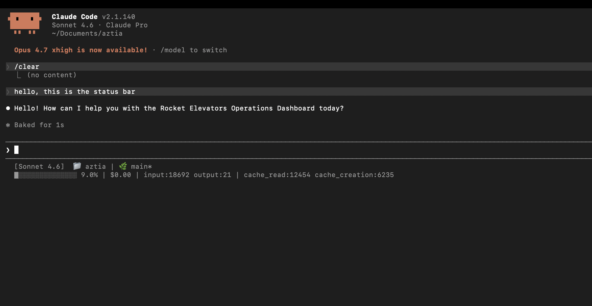

# Status Bar Notes

## AND-102 Task 4: Token Awareness and Status Bar

## Screenshot

## What Each Value Means

The status bar is rendered by `scripts/statusline.sh` and shows up at the bottom of every Claude Code session. 

- `[Sonnet 4.6]` — Which Claude model is running this session.
- `📁 aztia` — The project folder you’re currently working in.
- `🌿 main*` — Your active git branch. The * means you have local changes that aren’t committed yet.
- `█░░░░░░░░░░░░░░ 9.0%` — A quick visual of how much of the context window we’ve used.
- `$0.00` — Running cost in USD.
- `input:18692` — Total input tokens sent to the model so far.
- `output:21` — Total output tokens generated by the mode so far.
- `cache_read:12454` — Tokens pulled from the prompt cache (10 % cheaper, no re-processing).
- `cache_creation:6235` — Tokens written to the prompt cache for the first time this session.

## cache_read_input_tokens vs cache_creation_input_tokens

`cache_creation_input_tokens` counts tokens Claude processes and then stores in the prompt cache. This happens the first time a large block of context like CLAUDE.md shows up in a session. It costs a bit more than normal input tokens because Claude has to digest and store it.

`cache_read_input_tokens` counts tokens pulled from the cache on later turns instead of being re-processed. These are noticeably cheaper than normal input tokens and don’t require full re-encoding by the model.

If `cache_read_input_tokens` is non-zero, caching is working as expected: Claude is reusing context instead of starting from scratch each turn. In a healthy session, you’ll usually see `cache_read` grow larger than `cache_creation` over time, since the same blocks are reused while new cache writes happen only once.
